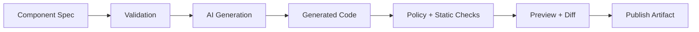
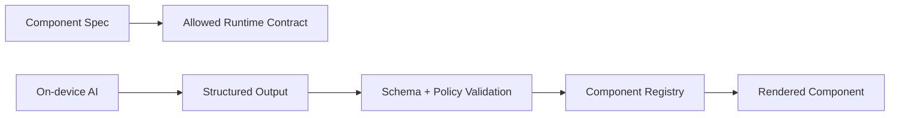

# RFC: Amaryllis Components Companion Module

## Status

Draft

## Summary

Introduce a companion module, working name **amaryllis-components**, that defines **personalized React components as governed, declarative specs**. The existing Amaryllis base module remains focused on on-device multimodal inference, streaming, sessions, and native model execution; the companion module builds on that foundation for adaptive UI.

This module shifts component development from ad hoc JSX authoring to **spec-driven, validated, and auditable generation pipelines**.

Runtime/on-device AI is allowed only to produce structured customization data, such as validated props, variant selections, slot text, or JSON patches against a component spec. It must not generate or execute arbitrary TSX, JSX, JavaScript, imports, or raw markup on device.

Runtime JSON patches must be interpreted as personalization overlays, not arbitrary mutations of the authoritative `ComponentSpec`.

---

## Goals

- Preserve the base Amaryllis module as the on-device multimodal inference layer
- Define a companion **amaryllis-components** module for adaptive component workflows
- Define a **typed, versioned component spec** as the primary artifact
- Enable **AI-assisted generation of React components** within strict constraints
- Enable **on-device component customization** through schema-validated structured outputs
- Ensure **reproducibility and auditability** of generated outputs
- Enforce **design system, accessibility, and security policies**
- Provide a **reviewable pipeline** (spec → generated artifact → validation → publish)

---

## Non-Goals

- Freeform AI-driven UI generation without constraints
- Replacing existing React ecosystems or design systems
- Runtime generation or execution of arbitrary component source code
- Figma-to-code or arbitrary design ingestion

---

## Core Concepts

### 1. Component Spec (Source of Truth)

A declarative artifact that defines:

- UI structure and constraints
- Behavior and state contracts
- AI generation boundaries
- Security and policy rules
- Target runtime and build outputs

### 2. Generated Artifact

A derived React implementation tied to:

- Spec version
- Model + prompt version
- Validator results
- Provenance metadata

### 3. Generation Pipeline

A deterministic (or bounded-nondeterministic) pipeline:



### 4. Governance Layer

Controls:

- Allowed imports and APIs
- Design system compliance
- Accessibility guarantees
- Security boundaries
- Review requirements

---

## Spec Schema (Draft)

```yaml
apiVersion: amaryllis/v1alpha1
kind: ComponentSpec

metadata:
  name: string
  version: semver
  owner: string
  stability: experimental|stable|deprecated

target:
  framework: react
  runtime: nextjs|web|rn
  ssr: boolean

props:
  type: object
  properties: {}
  required: []

ui:
  layout: string
  slots: []
  designTokens:
    spacing: []
    typography: []
    colorRoles: []
  accessibility:
    rules: []

behavior:
  state: {}
  events: []
  sideEffects: []
  constraints: []

ai:
  mode: scaffold|customize|personalize
  execution: build|ci|device
  allowedOperations: []
  forbiddenOperations: []
  generationContract:
    output: tsx|props-json|variant-selection|json-patch
    schemaRef: string
    styleSystem: tailwind|css-modules
    constraints: []
  validators: []

policy:
  imports:
    allow: []
    deny: []
  runtime:
    networkAccess: restricted|none
    domAccess: restricted
  review:
    requireHumanApproval: boolean
```

---

## AI Interaction Model

The module has three distinct AI modes. They may be introduced in phases, but they are intentionally separate contracts:

### Mode 1 — Scaffold

- AI generates component implementation from spec
- Output may be TSX/JSX when generation runs at build time, in CI, or in a developer tool
- No runtime AI behavior
- Strict validation + human review

### Mode 2 — Customize

- AI generates variants within defined slots and contracts
- Bounded customization of layout choices, copy, variants, and design-token selections
- Output may be TSX/JSX only when customization runs in the build/review pipeline
- On-device customization must output structured data only

### Mode 3 — Runtime Personalization

- Components may invoke on-device AI at runtime
- Runtime AI may choose variants, fill approved slots, adapt copy, or emit validated JSON patches
- Runtime AI must not emit executable component source code, arbitrary imports, raw markup, or unrestricted style values
- Requires strict policy, schema validation, telemetry, cancellation, and controls

---

## On-Device Customization Boundary

On-device AI can customize components when the generated output is treated as untrusted data and passed through validation before rendering. The safe runtime path is:



Allowed on-device outputs:

- Props JSON matching a declared schema
- Variant selections from an allowlist
- Slot text for declared slots
- Design token selections from approved token sets
- JSON Patch operations limited to approved spec paths

Forbidden on-device outputs:

- TSX, JSX, JavaScript, or executable code
- New imports, dependencies, or native module access
- Raw HTML or markup injection
- Arbitrary style strings outside approved tokens
- Network access changes or data access policy changes

Example runtime contract:

```yaml
ai:
  mode: personalize
  execution: device
  allowedOperations:
    - setSlotText
    - chooseVariant
    - chooseDesignToken
  forbiddenOperations:
    - addImport
    - executeCode
    - rawMarkup
    - networkAccess
  generationContract:
    output: props-json
    schemaRef: ./schemas/summary-card.personalization.schema.json
    constraints:
      - slots must be declared by the ComponentSpec
      - color values must reference design token names
      - generated copy must pass content policy checks
```

This allows mobile apps to personalize UI locally while preserving the RFC's core rule: the component spec and registry remain authoritative; AI is only a bounded data producer at runtime.

---

## Normative Validation Order

Implementations must validate artifacts in this order:

1. Parse the `ComponentSpec` through the versioned schema.
2. Enforce cross-field AI execution rules.
3. Enforce governance policy.
4. Generate source code or a runtime personalization contract.
5. Validate the generated source code or generated contract.
6. For customization patches, apply only allowed patch paths, then repeat schema and policy validation before generation.
7. For runtime AI output, validate against the generated personalization contract before rendering.

Device execution must reject any generation contract that can produce TSX, JSX, JavaScript, imports, raw markup, or executable code. Build and CI execution may produce source code only when policy requires human approval and source validation passes.

---

## Runtime Patch Boundary

Runtime JSON Patch output must be limited to declared personalization paths. Allowed paths are:

- `/props/<declared-prop-name>`
- `/variant`
- `/slots/<declared-slot-name>`
- `/designTokens/<declared-token-role>`

Runtime patches must not modify:

- `apiVersion`, `kind`, or `metadata`
- `target`
- `policy`
- `ai`
- `behavior.sideEffects`
- `ui.layout`
- imports, dependencies, native modules, or generated source code

Patch operations must be applied to a derived personalization overlay or render-props object. They must not mutate the canonical `ComponentSpec` stored in the registry.

---

## Source Validation Requirements

Build-time or CI generation that produces TSX, JSX, JavaScript, or TypeScript must validate the generated source before publication. At minimum, validation must enforce:

- Import allowlists and denylists from policy
- No dynamic imports, `eval`, `Function` constructors, or equivalent executable string sinks
- No raw HTML sinks such as `dangerouslySetInnerHTML` unless explicitly allowed by policy
- No undeclared identifiers outside generated props, local declarations, and allowed imports
- JSX element allowlists appropriate to the target runtime (`web`, `nextjs`, or `rn`)
- No access to native modules, network APIs, storage APIs, or process APIs unless policy allows them

String-based layout templates are considered untrusted source inputs and must pass the same generated-source validation before publication.

---

## Design And Accessibility Policy

Design token enforcement must define how tokens are referenced for each target runtime. Policies may allow framework-specific representations such as Tailwind class names, CSS module symbols, or React Native style tokens, but generated output must not introduce raw color, spacing, or typography values outside approved token sets unless policy explicitly allows an escape hatch.

Accessibility policy must define minimum checks for the target runtime. At minimum:

- Interactive controls require accessible labels.
- User-visible images or media require text alternatives unless marked decorative.
- Web output must satisfy semantic role and landmark rules configured by policy.
- React Native output must use appropriate accessibility props for controls and dynamic content.
- Generated copy and slot text must pass configured content-policy validators before rendering or publication.

---

## Artifact Model

Each generated component must include provenance. Provenance may be embedded in generated source comments, emitted as a sidecar JSON manifest, or both. A publishable artifact must record:

- Spec hash
- Model identifier + version
- Prompt template version
- Validation results
- Generation timestamp
- Diff against previous version

When strict deterministic builds are required, timestamps must live outside the deterministic source artifact or be normalized by the build system.

Human approval must be recorded as review metadata. Acceptable approval records include a signed manifest entry, PR approval, registry promotion event, or CLI approval record. Source generation that produces executable code must not be published without approval metadata.

---

## Registry Identity

The component registry is authoritative for runtime rendering. Registry entries must bind:

- Component name
- Component version
- Spec hash
- Runtime contract hash
- Component implementation identity

Registry keys should use `name@version` or an equivalent versioned identity. Registration must fail when a component implementation, spec hash, or runtime contract hash does not match the expected registry entry. Replacement semantics must be explicit: a registry may reject replacement, require a newer version, or require approval metadata.

---

## Policy Enforcement

### Static

- TypeScript validation
- ESLint rules
- Accessibility checks
- Design token enforcement

### Dynamic (future)

- Runtime guards
- AI invocation policies
- Data access restrictions
- Structured-output schema validation
- Component registry allowlists

---

## Security Considerations

### Threat Surfaces

- Dependency injection via generated imports
- Prompt injection via user-controlled inputs
- XSS via generated markup
- Data exfiltration via runtime AI
- Non-deterministic builds
- Runtime attempts to emit executable component code

### Required Controls

- Allowlist-based import system
- Output validation (AST-level for build-time source generation, schema-level for on-device customization)
- Strict schema enforcement
- No implicit network access
- Provenance tracking
- Human approval gates
- Runtime rendering through a prebuilt component registry

---

## Developer Workflow

1. Author or modify ComponentSpec
2. Run generation pipeline
3. Inspect:
   - Code diff
   - Visual preview
   - Validation results
4. Approve or regenerate
5. Publish artifact

---

## Open Questions

- Determinism requirements: strict vs best-effort
- Spec authoring surface: YAML vs DSL vs TS
- Visual diffing integration (Storybook?)
- How to handle escape hatches safely
- Registry design for published components

---

## Alternatives Considered

### Direct AI Code Editing

- Faster iteration
- Poor governance and reproducibility

### Prompt-as-Spec

- Flexible
- Not enforceable or testable

### Fully Static Components

- Safe
- No AI leverage

---

## Rollout Plan

### Phase 1

- Spec schema
- React generator
- Basic policy engine
- CLI integration
- Schema revalidation after customization patches
- Provenance emitted by generated artifacts

### Phase 2

- Customization workflows
- Preview + diff tooling
- Structured-output schemas for props, variants, and JSON patches
- JSON Patch path allowlists
- Generated-source validation for build and CI outputs
- Design token and accessibility validators

### Phase 3

- Runtime personalization for props, variants, and declared slots
- Runtime JSON Patch overlays limited to declared personalization paths
- Component registry identity and contract binding
- Telemetry, cancellation, error recovery, and governance extensions

---

## Summary

This module formalizes AI-assisted UI development as a **spec-driven, governed system** rather than an ad hoc generation workflow.

The key principle:

> The spec is authoritative. AI is an implementation tool operating within constraints.
