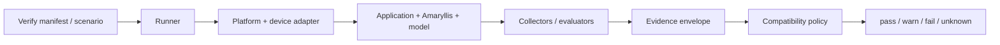

# RFC: Production Verification and Compatibility Evidence

## Status

Draft

Tracking issue: #97

Related issues:

- #88 — architecture review and trust-boundary hardening
- #94 — test pyramid and native static-analysis coverage
- #98 — Verify v1alpha1 runner and evidence schema
- #99 — operational evidence and telemetry privacy boundaries
- #101 — model artifact manifest and lifecycle trust contract

---

## Summary

Amaryllis should define a **local-first, portable production-verification contract** for answering whether a concrete application, Amaryllis runtime, model artifact, operating system, and device combination satisfies application-defined operational and quality budgets.

The output is **versioned compatibility evidence**, not a generic benchmark score and not a universal safety certification.

The contract must remain useful without any hosted Amaryllis service. A future orchestrator, device lab, model lifecycle service, or governance integration may schedule, retain, compare, or consume the same evidence, but must not require a proprietary measurement format.

This RFC establishes the architectural model and invariants. #98 owns the first concrete `v1alpha1` manifest, runner, and evidence schema.

---

## Motivation

Successful builds, unit tests, and integration tests do not prove that a particular on-device AI configuration is practical to ship across a target device population.

Production suitability depends on a compound subject:

```text
application/build
  + Amaryllis/runtime
  + model artifact
  + OS/runtime environment
  + device/hardware
        ↓
verification execution
        ↓
measurements + evaluation outcomes
        ↓
versioned evidence
        ↓
application-owned budgets/policy
        ↓
pass | warn | fail | unknown
```

Examples of questions that ordinary build/test coverage does not answer include:

- Does the model initialize within the application's startup budget?
- Is time to first token acceptable on the target device class?
- Does the configuration stay within memory and storage limits?
- Does cancellation release ownership correctly and allow subsequent requests?
- Does the application survive model initialization or generation failure?
- Are observed regressions tied to the app, model, runtime, OS, or hardware revision?
- Did a required measurement fail to run, or did it actually pass?

Amaryllis already has CI, native builds, contract validation, SBOMs, and release provenance. Production verification complements those controls by producing **runtime compatibility evidence for concrete deployed configurations**.

---

## Goals

- Define a common model for production-verification evidence.
- Keep local verification useful without hosted infrastructure.
- Identify exact application/runtime/model/device subjects strongly enough for regression comparison.
- Separate measurements from interpretation and policy decisions.
- Make application-defined budgets authoritative for pass/warn/fail outcomes.
- Preserve explicit `unknown` / unavailable states instead of silently treating missing evidence as success.
- Support Android and iOS without platform-specific top-level evidence schemas.
- Keep the evidence format portable across developer devices, CI-attached devices, customer-managed labs, and possible future managed runners.
- Make privacy-safe evidence the default.
- Leave extension points for signatures, artifact lifecycle, hosted orchestration, and governance without depending on them.

---

## Non-Goals

- Hosted verification SaaS.
- A managed device farm.
- Accounts, billing, RBAC, or SSO.
- A private or hosted model registry.
- Remote model deployment or fleet management.
- General mobile-device management.
- Universal model-quality rankings.
- Replacing unit, integration, E2E, fuzz, or native static-analysis testing.
- Automatic semantic-safety certification.
- Coupling Amaryllis to Anthesis or any other governance backend.
- Defining every platform-specific collector in this RFC.

---

## Terminology

### Subject

The exact configuration being evaluated. At minimum it includes:

- application/build identity;
- Amaryllis/runtime identity;
- model artifact identity;
- OS/runtime environment;
- device/hardware identity at the granularity needed for compatibility decisions.

### Measurement

A directly observed quantitative or categorical value produced during verification, for example initialization duration, peak memory, or request terminal state.

### Observation

A normalized or derived fact based on one or more measurements, for example "thermal throttling occurred during repetition 4" or "three of five executions exceeded the TTFT budget."

### Evaluation

An application- or test-suite-specific assessment of output quality or behavioral correctness. Evaluations are distinct from operational measurements because their meaning depends on the declared suite and scoring contract.

### Budget

An application-owned threshold or requirement used to interpret evidence, for example:

- initialization <= 2 s;
- peak RSS <= 1.5 GiB;
- cancellation must complete within 500 ms;
- required quality score >= 0.85.

Amaryllis may provide tooling and examples, but it must not silently invent universal acceptable budgets.

### Evidence

The versioned structured record containing subject identity, environment, provenance, measurements, observations, evaluations, errors, declared budgets, and resulting decision.

### Compatibility decision

A policy result derived from declared budgets and available evidence. The minimum states are `pass`, `warn`, `fail`, and `unknown`.

### Compatibility profile

A reusable set of declared budgets and required checks for a target application/device class or deployment cohort.

---

## Architectural Model

Verification has four separable responsibilities:



### 1. Scenario / manifest

Declares what should be executed and which budgets apply.

### 2. Runner

Owns orchestration, bounded execution, repetitions, warmup, cancellation, cleanup, and evidence assembly.

### 3. Platform/device adapter

Owns platform-specific launch and measurement capabilities. Unsupported measurements must remain explicit rather than being fabricated or inferred.

### 4. Evidence + compatibility policy

Records what happened, then evaluates declared requirements separately from collection.

This separation allows a future remote orchestrator to schedule the same runner contract without changing the evidence model.

---

## Evidence Model

The concrete `v1alpha1` schema belongs to #98. This RFC requires that every evidence document can represent the following conceptual sections.

### Envelope

```yaml
apiVersion: amaryllis.dev/verify/v1alpha1
kind: VerificationEvidence

metadata:
  id: string
  createdAt: timestamp

subject:
  application: {}
  runtime: {}
  model: {}

environment:
  platform: android|ios
  os: {}
  device: {}

provenance:
  runner: {}
  scenario: {}
  evaluationSuites: []

measurements: {}
observations: []
evaluations: []
unavailable: []
errors: []

policy:
  compatibilityProfile: {}
  budgets: {}

decision:
  status: pass|warn|fail|unknown
  reasons: []
```

The example is illustrative, not the final schema.

### Subject identity

Evidence must identify exact subjects strongly enough to prevent a mutable name or tag from being mistaken for an immutable tested artifact.

At minimum:

- application/build version or digest where available;
- Amaryllis package/runtime versions;
- model artifact cryptographic digest;
- relevant model format/runtime identity;
- OS version;
- device model/class and capability information required for the decision.

Model filenames, URLs, or mutable aliases are descriptive metadata and must not be the sole model identity.

### Provenance

Evidence must record enough information to answer how it was produced:

- runner/tool version;
- verification scenario/configuration identity;
- evaluation-suite versions;
- repetition/warmup/timeout policy;
- collector versions when their semantics can vary;
- timestamps/duration where meaningful.

### Measurements

The initial useful measurement families include:

- cold/warm initialization duration;
- time to first token where applicable;
- total generation duration and/or throughput where meaningful;
- peak process memory or best available platform equivalent;
- model/cache storage footprint;
- effective context constraints where measured;
- request completion/error state;
- cancellation and restart behavior;
- crash/OOM outcome.

Battery, energy, thermal, accelerator, and other platform data should be extensible but must not be claimed until the collector has reliable semantics for the platform.

### Evaluations

Application/model quality evidence must include the identity and version of the evaluation suite and enough scoring metadata to interpret the result.

Operational compatibility and semantic/model-quality evaluation must remain separable. For example, a model may satisfy memory and latency budgets while failing an application quality threshold.

### Unavailable evidence

Unavailable or unsupported measurements are first-class data.

Examples:

```yaml
unavailable:
  - metric: thermal.maxState
    reason: unsupported
  - metric: memory.peakRssBytes
    reason: collector-failed
```

A missing field alone is not sufficient when the metric was required by policy.

---

## Decision Semantics

At minimum:

### `pass`

All required checks were available and satisfied their declared required budgets. Advisory conditions may not be elevated to a failing state.

### `warn`

Required checks passed, but one or more declared advisory thresholds or conditions were exceeded.

### `fail`

At least one required check produced evidence that violates a declared budget or an explicit failure condition occurred.

Examples include:

- required latency budget exceeded;
- crash/OOM;
- lifecycle invariant failed;
- required evaluation score below threshold.

### `unknown`

A required decision cannot be made because evidence is unavailable, unsupported, incomplete, invalid, or the verification execution did not establish the required fact.

**`unknown` must never collapse into `pass`.**

The schema may later add more detailed execution/error states, but the compatibility decision must preserve this fail-explicit property.

---

## Policy Ownership

Compatibility budgets belong to the application or deployment policy, not the model and not Amaryllis globally.

For example, the same model/device evidence could reasonably produce different decisions for:

- an interactive chat application with a strict TTFT budget;
- a background summarization workflow with looser latency constraints;
- an offline field application with a strict storage budget;
- a regulated workflow requiring a specific evaluation suite.

This prevents Amaryllis from presenting generic benchmark values as universal product suitability.

---

## Privacy and Data Minimization

Production verification must be useful without capturing application/user content.

### Allowed by default

Examples of operational evidence that may be recorded by default:

- runtime/package versions;
- model digest and format metadata;
- platform/OS/device capability metadata needed for compatibility decisions;
- timings;
- memory/storage/resource measurements;
- lifecycle/error classifications;
- verification/evaluation suite identity;
- declared budgets and decision rationale.

### Excluded by default

The following must not be required or silently retained as ordinary operational evidence:

- prompts;
- generated model output;
- retrieved context;
- embeddings derived from application/user content;
- user documents/media;
- application payloads;
- authentication tokens or secrets;
- arbitrary raw logs likely to contain content.

Content-bearing evidence requires an explicit application-level policy and should be bounded/redacted where possible.

#99 owns the detailed threat-model and testable privacy requirements.

---

## Security and Robustness Invariants

- Treat model artifacts, fixtures, model output, and application output as untrusted inputs.
- Bound execution time, repetitions, output size, and retained diagnostics.
- Record an immutable model digest rather than trusting mutable names/tags.
- Preserve partial execution explicitly.
- Do not fabricate unsupported measurements.
- Use structured evidence instead of arbitrary logs as the primary interchange format.
- Ensure runner cancellation/interrupt paths perform bounded cleanup.
- Keep local verification usable without network access.
- Do not describe a passing result as a general security, safety, privacy, or regulatory certification.

---

## Relationship to Testing

Verification does not replace the test pyramid.

### Tests answer

- Is this deterministic behavior correct?
- Does this boundary reject invalid input?
- Does cancellation preserve ownership?
- Does this parser/state machine satisfy its invariants?

### Production verification answers

- Does this exact build/runtime/model/device configuration satisfy these declared deployment budgets?
- Did resource/performance behavior regress relative to prior evidence?
- Is the configuration suitable for a specific target cohort under the application's policy?

#94 owns deeper native integration, property/fuzz, and static-analysis work. Verify may reuse deterministic test scenarios as measurements/evaluations, but must not turn ordinary PR CI into a large-model/device-farm requirement.

---

## Relationship to CI

A local Verify result should be suitable for CI artifact retention and policy checking without requiring console-text parsing.

Potential future CI flow:

```text
build/test
   ↓
attach/select device
   ↓
run local Verify contract
   ↓
evidence.json
   ↓
compare baseline / evaluate policy
   ↓
retain artifact
```

Large physical-device or model matrices may run on explicit, scheduled, release, or customer-managed infrastructure rather than every pull request.

The current Node.js compatibility workflow is a toolchain compatibility check and should remain conceptually distinct from production application/model/device compatibility. #100 owns that terminology cleanup.

---

## Relationship to SBOM and Provenance

Existing SBOM and release provenance establish software supply-chain identity for Amaryllis packages and release assets.

Verification evidence should reference exact package/runtime/model identities rather than duplicating SBOM or attestation formats.

Where available, evidence may reference:

- package version/digest;
- model artifact digest;
- SBOM location/digest;
- provenance/attestation identity;
- source revision/build identity.

The goal is composability: **supply-chain evidence identifies what was built; production verification identifies how the concrete subject behaved on a target environment.**

---

## Model Artifact Identity and Future Lifecycle

The verification subject needs a durable model artifact identity before any hosted Model Registry exists.

#101 will define the storage-neutral manifest and lifecycle trust contract for:

- exact artifact digests;
- optional signatures/trust roots;
- provenance/SBOM references;
- compatibility-evidence references;
- revocation and rollback semantics;
- anti-replay/anti-downgrade requirements.

Verify must not depend on a hosted registry. Filesystem, application-owned, or existing artifact storage must remain valid sources when the required identity/integrity information is available.

---

## Future Orchestration

A future managed verification service may add:

- remote scheduling;
- managed physical-device execution;
- result retention/history;
- organization-private compatibility matrices;
- regression dashboards;
- policy administration;
- CI coordination.

Those capabilities should **orchestrate the same open runner/evidence contract** rather than introducing a hosted-only evidence format.

This is an interoperability constraint, not a commitment to build a service.

---

## Governance Integration

Evidence should be consumable through open interfaces by:

- CI systems;
- local files/artifact stores;
- SIEM or observability systems;
- application-specific governance tooling;
- Anthesis or another governance backend.

Amaryllis remains independently useful. Governance consumers do not become runtime dependencies.

---

## Versioning and Extensibility

The evidence contract must be explicitly versioned.

Requirements for #98:

- unknown fields can be handled according to documented forward-compatibility rules;
- required semantic changes require a schema/API version change;
- platform-specific measurements live in extensible sections rather than forking the top-level schema;
- a future hosted service must accept/produce the same public schema version as local tooling;
- experimental metrics must not silently become required policy inputs;
- evidence produced under an older schema remains distinguishable and interpretable.

---

## Validation Principles

A valid evidence document must not imply that the verification itself succeeded.

Validation should distinguish:

1. **schema validity** — the document is structurally valid;
2. **execution status** — the verification run completed, failed, or was partial;
3. **evidence availability** — required facts were or were not measured;
4. **compatibility decision** — declared policy produced pass/warn/fail/unknown.

This prevents malformed documents, collector failures, or partial runs from being confused with policy failures or successful compatibility decisions.

---

## Example Decision

Illustrative only:

```yaml
policy:
  budgets:
    initializationMs:
      requiredMax: 2000
    ttftMs:
      requiredMax: 750
    peakRssBytes:
      requiredMax: 1610612736
    cancellationRestart:
      required: true

decision:
  status: warn
  reasons:
    - code: advisory-throughput-regression
      message: generation throughput regressed 8% from the selected baseline
```

The evidence should retain the measurements behind the decision so callers can re-evaluate them against different application-owned budgets without rerunning the device when appropriate.

---

## Open Questions for #98

- Which package should own the Verify CLI and schemas?
- JSON Schema, TypeScript-first schema generation, or another representation?
- How should build/application identity be represented across development, CI, and release builds?
- Which device identifiers provide reproducibility without creating unnecessary persistent tracking identifiers?
- Which Android/iOS memory metrics are sufficiently comparable to use in cross-run policy?
- How should repetitions and statistical summaries be represented without hiding raw sample outcomes?
- Should the compatibility decision be embedded in the same evidence document or represented as a derived companion artifact?
- How should evidence baselines be selected and identified?
- Which exit codes distinguish runner/tool failure from a valid `fail` compatibility decision?

---

## Adoption Sequence

1. Accept this architecture and terminology.
2. Define the first `v1alpha1` manifest, evidence schema, and runner contract in #98.
3. Add the privacy/threat-model boundary from #99.
4. Implement the smallest useful local Verify path against developer/CI-attached devices.
5. Produce example Android and iOS evidence fixtures.
6. Prove that CI can retain/compare evidence without hosted infrastructure.
7. Only then evaluate broader orchestration or managed execution based on demonstrated demand.

---

## Decision

Amaryllis production verification is an **open, local-first evidence capability**.

The authoritative artifact is a versioned evidence record for an exact application/runtime/model/environment subject. Application-owned budgets derive compatibility decisions from that record. Unsupported or missing required evidence produces an explicit non-pass state. Operational evidence excludes application/user content by default.

Hosted orchestration, Model Registry, Deploy, and governance services are optional future consumers/producers of the same open contracts, not prerequisites for safe use of Amaryllis.
